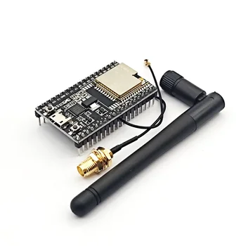
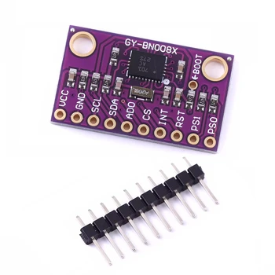
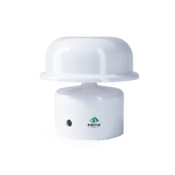
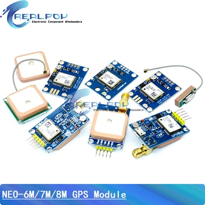
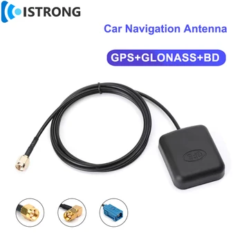
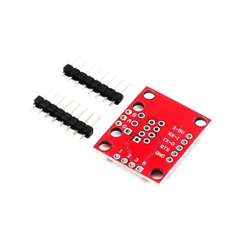

This page lists the modules used by the current Veetr prototype. Check the model number, connector type, and voltage before ordering: marketplace listings and board revisions can change without notice.

## Shopping checklist

- ESP32 DevKitC with an ESP32-WROOM-32U module and external antenna connector
- BNO080 or BNO085 nine-axis IMU breakout board
- RS485 ultrasonic wind sensor
- GPS receiver module and external GPS antenna
- RS485-to-TTL converter compatible with 3.3 V logic
- Veetr carrier PCB and 3D-printed enclosure
- External BLE antenna, USB-C cable, connectors, headers, and mounting hardware

## Main controller

### ESP32 DevKitC WROOM-32U

| Property | Requirement |
| --- | --- |
| Module | ESP32-WROOM-32U |
| Antenna | External 2.4 GHz antenna connector |
| Logic voltage | 3.3 V |
| Power/programming | USB-C on the development board |
| Interfaces used | I²C, UART, GPIO, and BLE |
| Onboard controls | RESET/EN and BOOT |

The `-32U` variant matters because it provides the external antenna connection used by the enclosure. See the **[wiring guide](https://veetr.org/docs/wiring/)** before connecting any module.

**Purchase link:** [ESP32 DevKitC WROOM-32U](https://s.click.aliexpress.com/e/_c3ctWFj9)

## Motion sensor

### BNO080/BNO085 nine-axis IMU

| Property | Requirement |
| --- | --- |
| Sensor | BNO080 or BNO085 with onboard sensor fusion |
| Interface | I²C |
| Logic voltage | 3.3 V |
| Veetr measurements | Heading, heel, pitch, and motion |

Choose a breakout board that exposes `VCC`, `GND`, `SDA`, and `SCL` and is compatible with 3.3 V logic.

**Purchase link:** [BNO080/BNO085 breakout board](https://s.click.aliexpress.com/e/_okDR7nd)

## Wind sensor

### RS485 ultrasonic wind sensor

| Property | Prototype requirement |
| --- | --- |
| Measurements | Apparent wind speed and direction |
| Interface | RS485 Modbus RTU |
| Default serial rate | 9600 baud |
| Supply | Verify the sensor label; the current prototype uses a 5–12 V model |
| Installation | Clear exposure to wind, typically at the masthead or on deck |

The wind sensor connects to the RS485 side of the converter, not directly to ESP32 GPIO pins.

**Purchase link:** [RS485 ultrasonic wind sensor](https://s.click.aliexpress.com/e/_onkySgT)

## GPS

### GPS receiver module

| Property | Prototype requirement |
| --- | --- |
| Receiver | NEO-8M-family breakout board |
| Interface | UART |
| Supply | Use the voltage accepted by the specific breakout board |
| Data | NMEA position, speed, course, time, and signal status |
| Antenna | Built-in patch or compatible external antenna |

**Purchase link:** [GPS receiver module](https://s.click.aliexpress.com/e/_onLOZmT)

### External GPS antenna

Match the antenna connector and active-antenna requirements to the GPS receiver module you buy.

**Purchase link:** [External GPS antenna](https://s.click.aliexpress.com/e/_oExx7iF)

## RS485 converter

### RS485-to-TTL module

| Property | Requirement |
| --- | --- |
| Function | Converts the wind sensor’s differential RS485 signal to ESP32 UART logic |
| Logic side | Compatible with 3.3 V ESP32 signals |
| Sensor side | `A`/`B` differential pair |
| Control | Exposes driver/receiver enable (`DE`/`RE`) |

Module labels vary. Confirm the pin names against the board you receive before using the **[wiring table](https://veetr.org/docs/wiring/)**.

**Purchase link:** [RS485 converter module](https://www.aliexpress.com/item/32688467460.html)

## PCB and enclosure

The custom Veetr carrier PCB holds the modular boards and routes their power and signals. Manufacturing files are available in the repository’s **[PCB directory](https://github.com/veetrlabs/veetr/tree/main/pcb)**, including the **[Gerber files](https://github.com/veetrlabs/veetr/tree/main/pcb/gerbers)**.

The enclosure is 3D printed and provides the RJ45, BLE antenna, USB-C, and GPS antenna openings. Verify the PCB revision and connector placement before printing it.

The former Veetr kit page also listed the headers, RJ45 socket and plugs, shielded data cable, M2.6 screws, Allen keys, 330 Ω resistor, and green status LED used during assembly. Those supplier links and descriptions are preserved in the **[complete former parts list](https://veetr.org/kit/#parts)**.

## Affiliate-link note

Some purchase links are affiliate links. If you buy through them, a small portion supports Veetr without changing your price. You can instead search for the exact model names above and buy from another supplier.
