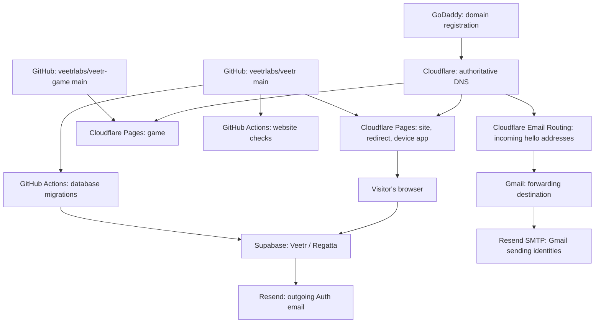

# Deployment architecture and operations

Maintainer documentation, last verified 12 September 2026. This file is kept in
GitHub and is not included in the public website's documentation build. It
describes the infrastructure and deployment process; it contains no credentials.

## How the services fit together



Cloudflare serves the static frontend. The browser connects directly to Supabase
for accounts and race data; there is no application server running inside Pages.
The device app at `app.veetr.org` is the sailing instrument dashboard. Race
management is integrated into the main website, not hosted in that device app.

## Ownership and boundaries

| Service | Location | Responsibility |
| --- | --- | --- |
| GoDaddy | `veetr.org` and `veetr.com` registrations | Domain renewal and nameserver delegation |
| Cloudflare | Personal account, separate from the official Mautic account | DNS, Pages, incoming email forwarding |
| GitHub | `veetrlabs` organization | Source, build checks, database deployment automation |
| Supabase | **Veetr** organization → **Regatta**, ref `xvqlsltglpgfjhdrhdyc` | Auth and race-management database |
| Resend | `linhart` team | Verified sending domains and outgoing email |
| Gmail | Verified forwarding destination | Receives replies and sends as the two hello identities |

Always check the selected account and project before changing settings. Mautic
organizations, projects, and credentials are outside this deployment. The
Cloudflare GitHub installation is restricted to `veetrlabs/veetr` and
`veetrlabs/veetr-game`; the Resend Supabase connection is scoped to Veetr.

## Websites and source locations

| Public hostname | Pages project | Source and production branch | Root directory | Build command | Output directory |
| --- | --- | --- | --- | --- | --- |
| `veetr.org`, `www.veetr.org` | `veetr-site` | `veetrlabs/veetr`, `main` | Repository root | `npm run build --workspace veetr.org` | `veetr.org/dist` |
| `veetr.com` | `veetr-com` | `veetrlabs/veetr`, `main` | `veetr.com` | `exit 0` | `.` |
| `app.veetr.org` | `veetr-app` | `veetrlabs/veetr`, `main` | Repository root | `npm run build --workspace pwa` | `pwa/dist` |
| `game.veetr.org` | `veetr-game` | `veetrlabs/veetr-game`, `main` | Repository root | `exit 0` | `.` |

Each project's preview hostname is `<project>.pages.dev`. `veetr.com` serves the
redirects to the main site. The game is static source; it has no build
step. The main site uses Astro with embedded React race-management screens at
`/races/`, `/races/manage/`, `/boats/`, and `/account/`.

The site and device app use `NODE_VERSION=22.19.0`. The `veetr-site` build also
needs `VITE_SUPABASE_URL` and `VITE_SUPABASE_ANON_KEY`, configured in Pages for
production and previews. These are public browser configuration for Regatta.
An administrative or service-role key must never be used in the frontend.

## What happens when code changes

1. Push or merge source changes into the relevant repository's `main` branch.
2. Cloudflare's GitHub integration builds and deploys its connected Pages
   projects. Inspect the project's Deployments tab for build logs and status.
3. In the main repository, [Website checks](../.github/workflows/site-checks.yml)
   runs for relevant pushes and pull requests. It checks race/database behavior,
   builds and tests the main site, and builds the device app.
4. If SQL migrations change, [Deploy Veetr database](../.github/workflows/supabase-production.yml)
   runs separately. It tests, links to Regatta, previews pending migrations,
   applies them, and prints migration history. It can also be started manually
   on `main` from GitHub Actions.

**Pages deployment and GitHub Actions are independent.** A successful Pages
build does not mean the migration workflow passed, and website checks are not a
deployment gate. Use backward-compatible migrations: add the new schema first,
deploy the frontend that uses it, and remove obsolete schema in a later release.
For a tightly coupled release, verify the migration before releasing dependent
frontend changes.

The migration workflow has a fixed Regatta project reference and serializes
database deployments. It uses `VEETR_SUPABASE_ACCESS_TOKEN` from GitHub Actions
secrets to obtain temporary database login credentials. It applies pending SQL
migrations without resetting the database or loading seed data.
See [Database deployment](DATABASE_DEPLOYMENT.md) for details.

## Email flows

### Auth emails from the website

```text
Signup or password reset in the browser
  → Supabase Auth (Regatta)
  → Resend SMTP
  → recipient, from Veetr <hello@veetr.org>
```

Supabase SMTP is configured through Resend's native integration:

- Server: `smtp.resend.com`; port **465**; username `resend`.
- Sender: **Veetr**, `hello@veetr.org`.
- Site URL: `https://veetr.org`.
- Allowed account callbacks: `https://veetr.org/account/` and
  `https://www.veetr.org/account/`.

Preview builds use the same Regatta backend. They are not isolated staging
databases, and arbitrary preview hostnames are not allowed Auth callback URLs.

### Incoming replies and Gmail sending

Cloudflare Email Routing forwards both `hello@veetr.org` and `hello@veetr.com`
to the verified Gmail destination. These are forwarding addresses, not separate
mailboxes with their own inboxes or passwords.

Both addresses are also confirmed Gmail “Send mail as” identities. Gmail sends
through Resend at `smtp.resend.com`, port **587**, using **TLS** and username
`resend`. Each identity uses a separate sending-only key restricted to its
domain. The Supabase Auth integration uses a separate credential. Select the
desired Veetr identity in Gmail's From field when composing a message.

## DNS responsibilities

Both domains use these Cloudflare nameservers:

- `apollo.ns.cloudflare.com`
- `eleanor.ns.cloudflare.com`

GoDaddy is the registrar, Cloudflare hosts authoritative DNS, and Pages manages
the website custom-domain routing.

| Records | Managed for | Maintenance rule |
| --- | --- | --- |
| Website A/AAAA/CNAME routing | Cloudflare Pages custom domains | Change through the corresponding Pages project and verify its custom-domain status |
| Root MX, SPF, and Email Routing DKIM | Cloudflare Email Routing | Preserve for incoming mail forwarding |
| `send` subdomain MX/SPF and `resend._domainkey` | Resend | Preserve for authenticated outgoing email |
| `.org` DMARC and verification TXT records | Domain policies and ownership verification | Retain unless deliberately replacing the related service or policy |
| `m.veetr.com` → `165.232.83.73` | Independent service | Managed separately from Pages; leave intact when changing website hosting |

Root incoming-mail MX and Resend's sending-subdomain MX coexist. Do not replace
one set with the other when troubleshooting delivery.

## Where to operate and troubleshoot

| Task or symptom | Start here |
| --- | --- |
| Website build failure or old frontend | [Cloudflare Workers & Pages](https://dash.cloudflare.com/3f653896af0d566aa936d16351ba4040/workers-and-pages), select the Pages project → Deployments |
| Custom hostname fails but `pages.dev` works | Pages → Custom domains, then the domain's Cloudflare DNS records |
| Missing database function or table | [Database deployment runs](https://github.com/veetrlabs/veetr/actions/workflows/supabase-production.yml); compare local and remote migration histories |
| Signup callback goes to the wrong location | [Regatta Auth URL configuration](https://supabase.com/dashboard/project/xvqlsltglpgfjhdrhdyc/auth/url-configuration) |
| Auth email fails to send | Regatta Auth SMTP settings, then [Resend email logs](https://resend.com/emails) and [domain verification](https://resend.com/domains) |
| Replies do not arrive | Cloudflare Email Routing rules and destination verification, then Gmail spam |
| Gmail sends from the wrong address | [Gmail Accounts and Import](https://mail.google.com/mail/u/0/#settings/accounts), then the message's From selector |
| Deployment access token expires | [Supabase Access Tokens](https://supabase.com/dashboard/account/tokens) and [repository Actions secrets](https://github.com/veetrlabs/veetr/settings/secrets/actions) |

For a frontend rollback, use a previous successful deployment in the same Pages
project. Database rollback is separate: inspect the applied migration history
and write a corrective migration. Do not reset production or edit an already
applied migration to roll back a release.

## Documentation publishing

The website documentation loader in
[`veetr.org/src/content.config.ts`](../veetr.org/src/content.config.ts) explicitly
lists the Markdown files it publishes. `DEPLOYMENT.md`, `HOSTING.md`, and
`DATABASE_DEPLOYMENT.md` are outside that list. Keep maintainer-only guides out of
that list and out of the website's static/public directories. Repository-only
means excluded from the website; it does not make files private in this public
GitHub repository.

## Release verification

- Confirm the relevant Pages deployments and GitHub checks succeeded.
- Confirm local and Regatta migration histories match after a schema change.
- Open each affected production hostname and verify its main functionality.
- Check that the race directory loads from Supabase without database errors.
- After Auth or email changes, test an actual signup or password-reset email,
  an outgoing message from each affected Gmail identity, and incoming replies.

## Regatta access and sharing

Everyone uses the same `/races/` and `/boats/` pages. Signed-in users see creation,
editing, and team controls according to their permissions. Authorized series
editors also see that series' drafts and private details in these same pages.
Public visitors receive the database's published projection, never the full
private series document.

| Role | Permissions |
| --- | --- |
| Approved organizer | Create a series; becomes its owner |
| Series owner | Edit all races and heats, manage the team, delete series entities; ownership cannot be removed by teammates |
| Series admin | Edit the series and its races/heats, manage teammates, delete series entities |
| Race official | Edit series details, entries, heats, and results; cannot manage teammates or delete series entities |
| Signed-in user | Create a boat; becomes its owner |
| Boat owner | Edit the boat profile, add/remove boat editors, delete it once removed from every series |
| Boat editor | Edit the boat profile; cannot manage sharing or delete it |

Series permissions cover the races and heats inside that series. Boat permissions
are independent: entering a boat in a series does not give that series' admins
ownership or editing rights over its global profile. Editing a boat updates its
stored name/class/length in all associated series without exposing those series
to the boat editor.

### Approve an organizer

A maintainer uses the **Veetr / Regatta** Supabase dashboard for this small
administrative task. Regular organizers and teammates need only a Veetr account,
not Supabase dashboard access.

1. The person creates and confirms their account on Veetr.
2. In [Regatta Auth users](https://supabase.com/dashboard/project/xvqlsltglpgfjhdrhdyc/auth/users), find their account and copy its user ID.
3. In [Regatta Table Editor](https://supabase.com/dashboard/project/xvqlsltglpgfjhdrhdyc/editor), open `public.series_creators` and insert a row with that ID in `user_id`.
4. The signed-in person's series directory will show **New series** after the next permission refresh (about five seconds).

Delete that approval row to stop future series creation. It does not remove
ownership or access to existing series. Existing series owners are approved by
the permission migration. No user can grant themselves organizer approval from
the app or its public API.

### Share an entity

On a series page, an owner/admin opens **Series team**, enters a teammate's email,
and chooses **Race official** or **Series admin**. On a boat page, its owner opens
**Boat crew** and adds an editor by email. Teammates must already have signed in to
Veetr once. Changes take effect immediately on the server; this does not send an
invitation email. Remove a teammate in the same panel to revoke access.

The database enforces these rules even if someone bypasses the visible buttons.
Cached private series are shown only after the current session's access has been
checked. Offline edits can continue during an already verified session; a fresh
offline page load needs connectivity before it can unlock private editing.

## Series permission requests

Unapproved signed-in users can request series-creation access with a note. Requests are stored in `series_access_requests`; one request per account prevents repeated submissions. Verified email is required.

The `creation-request-email` Supabase Edge Function authenticates the requester and sends via Resend using the server-only `RESEND_API_KEY` secret. The dedicated Resend key is sending-only and restricted to veetr.org. Notifications go from and to `hello@veetr.org`, with Reply-To set to the requester. Existing Cloudflare routing delivers these to the maintainer. Failed sends leave the request pending and offer a retry; sent requests are marked and use an idempotency key.

Insert an administrator's Auth user ID into `public.platform_admins` through the Regatta Table Editor. Administrators review pending requests on `/account/` and approve or decline; approval inserts the requester into the existing `series_creators` table. Neither email links nor ordinary users can grant access. No administrators are seeded automatically.

The database workflow deploys this function after applying migrations. Supabase Auth SMTP and Gmail identity credentials remain separate and unchanged.
